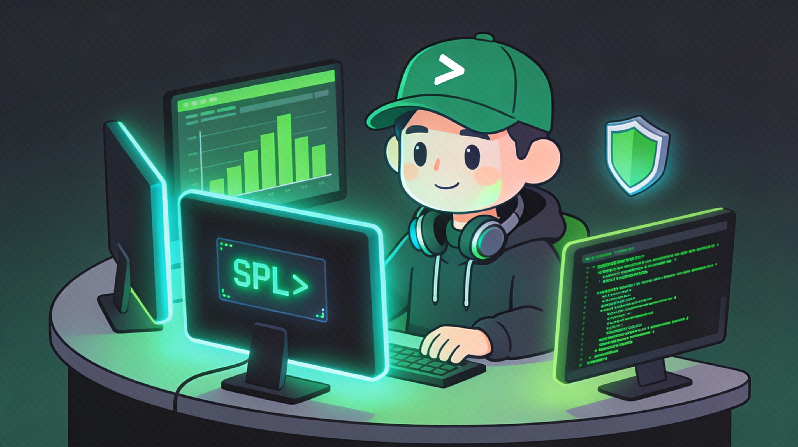
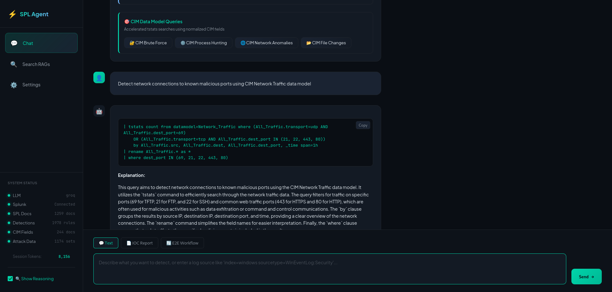
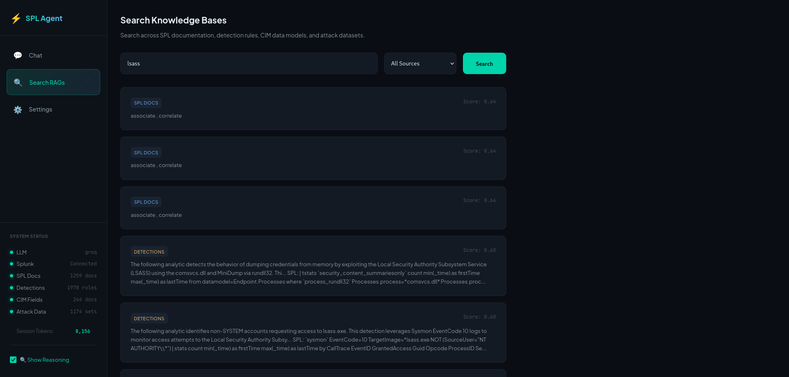

<div align="center">
  
  
  # Splunk Detection Engineer Agent
  
  **AI-Powered SPL Query Generation for Security Analytics**
  
  
  
  
  
</div>

---

## What is this?

An intelligent AI agent that generates production-ready **Splunk SPL queries** from natural language. It eliminates hallucination by using **RAG (Retrieval-Augmented Generation)** to ground every response in real documentation:

- **4,400+ RAG-indexed documents** — SPL docs, detection rules, CIM fields, and attack data
- **Live Splunk validation** — Connects to your Splunk instance to verify queries actually work
- **Iterative refinement** — Automatically fixes syntax errors and field mismatches

**Perfect for:** Security analysts, SOC engineers, detection engineers, and threat hunters.

> **Note:** This project is under active development. Contributions and feedback are welcome!

---

## Features

| Feature | Description |
|---------|-------------|
| **Natural Language Input** | Describe what you want to detect in plain English |
| **RAG-Powered Grounding** | 4 vector databases: SPL docs, detection rules, CIM fields, attack data |
| **Live Splunk Validation** | Connects to your Splunk instance to test queries return real results |
| **Chain of Thought** | See exactly how the agent reasons and builds your query |
| **Multi-LLM Support** | Groq (free), Mistral, OpenRouter, Claude, OpenAI |
| **Web Interface** | Modern dark-themed dashboard for interactive use |

---

## Screenshots

<div align="center">



*Chat interface with chain of thought reasoning*



*Search across 4,400+ documents in the knowledge base*

</div>

---

## Quick Start

### Prerequisites

- Python 3.11+
- Access to a Splunk Enterprise instance
- LLM API key ([Groq](https://console.groq.com) recommended - free tier)

### Installation

```bash
# Clone and setup
git clone https://github.com/michaelelizarov/splunk-detection-engineer-agent.git
cd splunk-detection-engineer-agent
python -m venv venv
source venv/bin/activate  # Windows: venv\Scripts\activate

# Install dependencies
pip install torch --index-url https://download.pytorch.org/whl/cpu
pip install -r requirements.txt
playwright install chromium

# Configure
cp config/config.yaml.example config/config.yaml
# Edit config/config.yaml with your API keys and Splunk credentials

# Initialize knowledge bases
python -m src.rag_spl_docs ingest
python -m src.rag_detections ingest
python -m src.rag_cim_docs ingest
python -m src.rag_attack_data ingest

# Verify setup
python -m src.agent status
```

### Basic Usage

```bash
# Generate a detection query
python -m src.agent run "Detect brute force login attempts"

# With reasoning trace
python -m src.agent run --reason "Detect credential dumping from LSASS"

# Interactive mode
python -m src.agent interactive

# Web interface
python -m src.api.server
# Open http://localhost:8000
```

---

## Documentation

| Document | Description |
|----------|-------------|
| **[Command Reference](docs/COMMAND_REFERENCE.md)** | Complete list of all CLI commands |
| **[Usage Guide](docs/USAGE.md)** | Detailed usage examples and query types |
| **[Configuration](docs/CONFIGURATION.md)** | LLM and Splunk configuration options |
| **[Web Interface](docs/WEB_INTERFACE.md)** | Web dashboard features and API |
| **[Knowledge Bases](docs/KNOWLEDGE_BASES.md)** | Updating and managing data sources |
| **[Troubleshooting](docs/TROUBLESHOOTING.md)** | Common issues and solutions |
| **[Architecture](docs/ARCHITECTURE.md)** | System design and diagrams |
| **[API Reference](docs/API_REFERENCE.md)** | Python library usage |
| **[Project Structure](docs/PROJECT_STRUCTURE.md)** | Codebase organization |

---

## Contributing

See [CONTRIBUTING.md](CONTRIBUTING.md) for development setup and guidelines.

---

## Security

See [SECURITY.md](SECURITY.md) for vulnerability disclosure.

**Important:** Always review AI-generated queries before running in production.

---

## License

MIT License - see [LICENSE](LICENSE)

---

## Acknowledgments

- [Splunk](https://www.splunk.com/) for SPL documentation
- [Splunk Security Content](https://github.com/splunk/security_content) for detection rules
- [Splunk Attack Data](https://github.com/splunk/attack_data) for attack datasets
- [Groq](https://groq.com/) for free LLM API
- [ChromaDB](https://www.trychroma.com/) for vector storage
