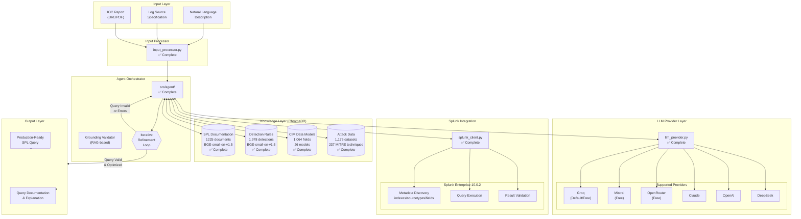
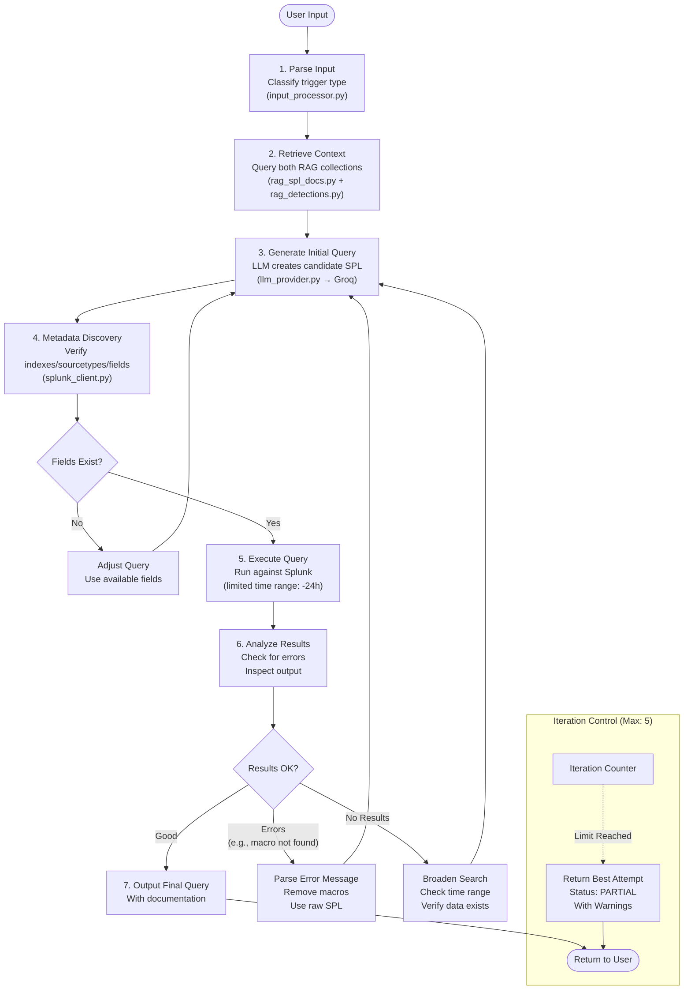
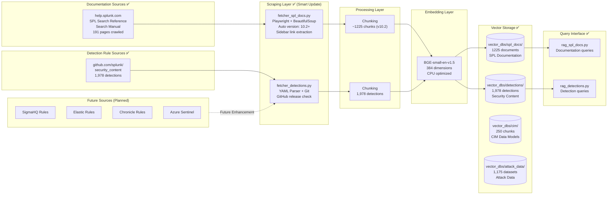
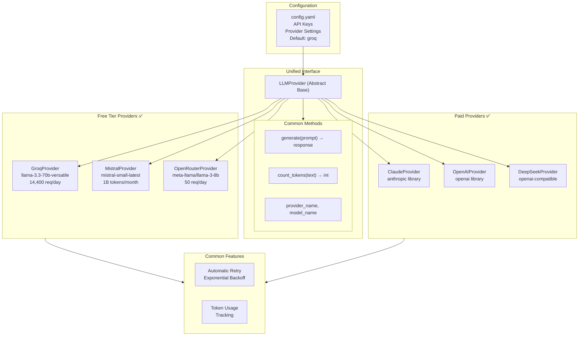
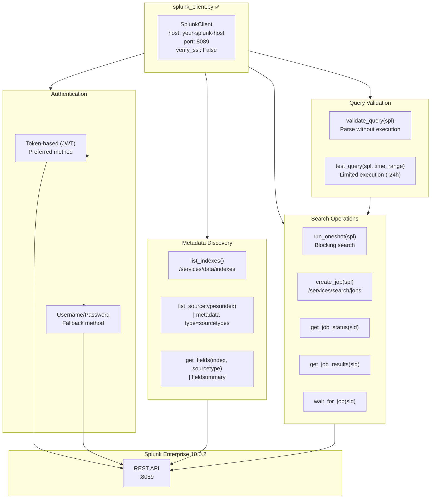
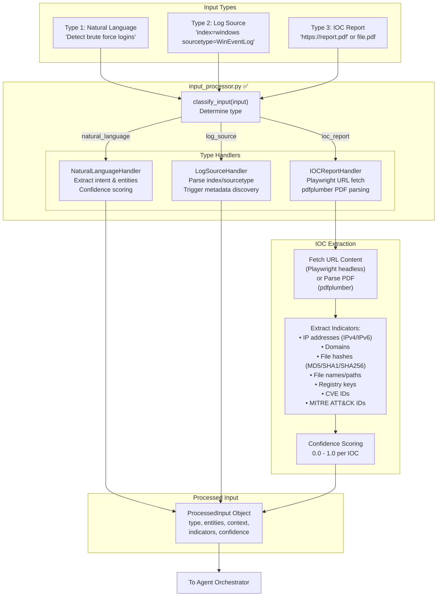
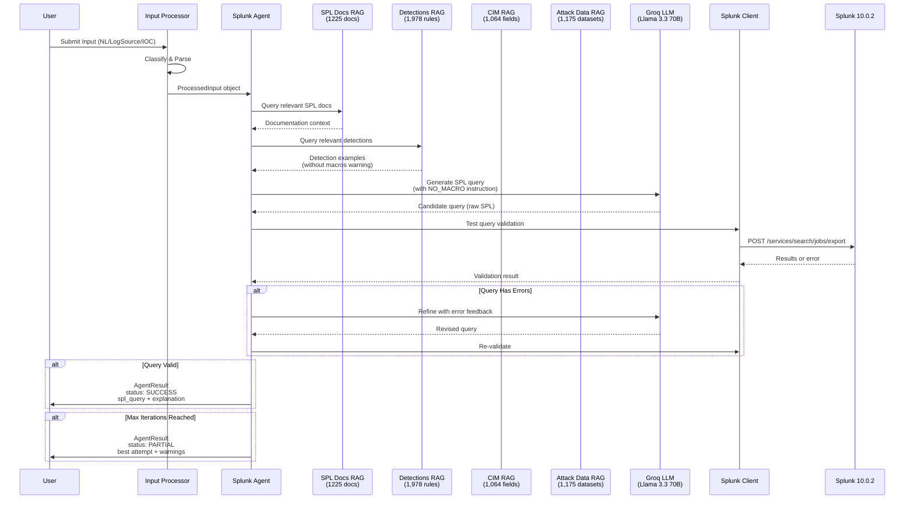
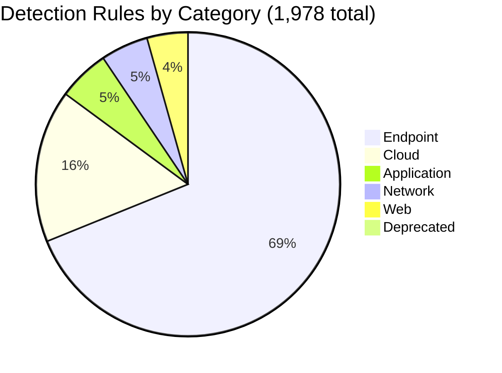
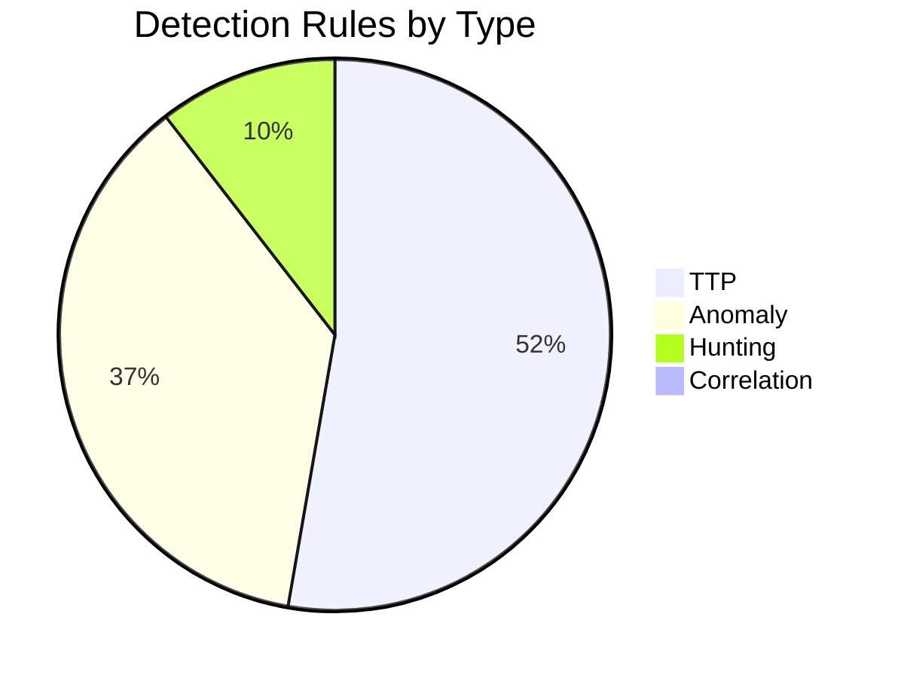

# Splunk SPL Agent - System Architecture Diagrams

This document contains Mermaid diagrams visualizing the technical architecture of the Splunk SPL Agent system.

**Project Status:** All 5 phases complete. Agent fully operational.

---

## Diagram 1: High-Level System Architecture

---

## Diagram 2: Agent Workflow (Iterative Refinement Process)

---

## Diagram 3: Knowledge Base Architecture

---

## Diagram 4: LLM Provider Interface

---

## Diagram 5: Splunk REST API Client

---

## Diagram 6: Input Processing Flow

---

## Diagram 7: Complete Data Flow

---

## Diagram 8: File Structure

```mermaid
flowchart TD
    subgraph ROOT["splunk-detection-engineer-agent/"]
        subgraph FOUNDATION["Foundation ✅"]
            F1["parser_spl_docs.py<br/>HTML Parser"]
            F2["fetcher_spl_docs.py<br/>Web Crawler"]
            F3["rag_spl_docs.py<br/>Documentation RAG"]
            F4["requirements.txt<br/>Dependencies"]
        end
        
        subgraph PHASE1["Phase 1 ✅"]
            F5["llm_provider.py<br/>Multi-LLM Interface<br/>Groq/Mistral/OpenRouter"]
            F6["config.yaml<br/>Configuration"]
        end
        
        subgraph PHASE2["Phase 2 ✅"]
            F7["splunk_client.py<br/>Splunk REST API"]
        end
        
        subgraph PHASE3["Phase 3 ✅"]
            F8["fetcher_detections.py<br/>YAML Parser"]
            F9["rag_detections.py<br/>Detection RAG"]
        end
        
        subgraph PHASE4["Phase 4 ✅"]
            F10["input_processor.py<br/>NL/LogSource/IOC Handlers"]
        end
        
        subgraph PHASE5["Phase 5 ✅"]
            F11["src/agent/<br/>Agent Package"]
        end
        
        subgraph DATA["Data Directories"]
            D1["data/<br/>Crawled docs & detections"]
            D2["vector_dbs/spl_docs/<br/>1225 documents"]
            D3["vector_dbs/detections/<br/>1,978 detections"]
            D4["vector_dbs/cim/<br/>250 chunks"]
            D5["vector_dbs/attack_data/<br/>1,175 datasets"]
            D4["security_content/<br/>Cloned repository"]
        end
        
        subgraph GENERATED["Generated Files"]
            G1["splunk_spl_docs.jsonl"]
            G2["crawl_manifest.json"]
            G3["splunk_spl_detections.jsonl"]
            G4["splunk_detections.stats.json"]
        end
    end
    
    FOUNDATION --> PHASE1
    PHASE1 --> PHASE2
    PHASE2 --> PHASE3
    PHASE3 --> PHASE4
    PHASE4 --> PHASE5
```

---

## Diagram 9: Detection Rules Statistics

---

## How to Render These Diagrams

These Mermaid diagrams can be rendered using the following tools:

1. **VS Code** — Install the "Markdown Preview Mermaid Support" extension
2. **GitHub** — Paste directly into any .md file; GitHub renders Mermaid natively
3. **Mermaid Live Editor** — Visit https://mermaid.live and paste the diagram code
4. **Obsidian** — Native Mermaid support in notes
5. **Notion** — Use the /code block with "mermaid" language

---

## Document Metadata

| Attribute | Value |
|-----------|-------|
| Created | January 2025 |
| Last Updated | January 2025 |
| Diagrams | 9 |
| Format | Mermaid |
| Project Status | Complete (5/5 phases) |
